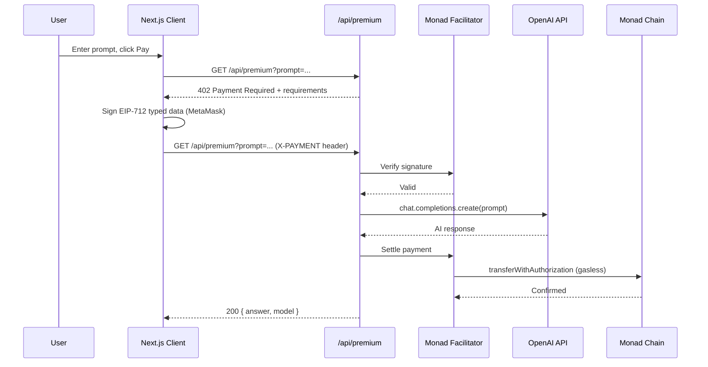

# x402 Pay-per-Query AI on Monad

A pay-per-query AI endpoint built with the [x402 protocol](https://docs.x402.org) on [Monad](https://monad.xyz). Each AI query costs $0.01 USDC, settled on-chain via EIP-3009 `transferWithAuthorization` through the Monad facilitator. No accounts, no subscriptions — just sign and pay.

## Architecture



## Tech Stack

- **Frontend**: Next.js 16, React 19, Tailwind CSS, wagmi v3
- **Payments**: x402 protocol v2 ([@x402/core](https://www.npmjs.com/package/@x402/core), [@x402/evm](https://www.npmjs.com/package/@x402/evm), [@x402/next](https://www.npmjs.com/package/@x402/next))
- **Chain**: Monad Testnet (chain ID 10143), USDC via ERC-3009
- **AI**: OpenAI GPT-4o-mini
- **Facilitator**: [Monad x402 Facilitator](https://x402-facilitator.molandak.org) (covers gas, handles settlement)

## Setup

### Prerequisites

- Node.js 18+
- MetaMask or any injected wallet
- Monad testnet USDC (get from [Circle Faucet](https://faucet.circle.com/) — select Monad Testnet)
- Monad testnet MON for gas (get from [Monad Faucet](https://faucet.monad.xyz/))
- An OpenAI API key

### Install

```bash
git clone <repo-url> && cd private-x402
npm install
```

### Configure

Create a `.env.local` file:

```
PAY_TO_ADDRESS=0xYourWalletAddress
OPENAI_API_KEY=sk-your-openai-key
```

`PAY_TO_ADDRESS` is the wallet that receives USDC payments.

### Run

```bash
npm run dev
```

Open [http://localhost:3000](http://localhost:3000), connect your wallet, type a prompt, and pay $0.01 USDC to get an AI response.

## Project Structure

```
src/
  app/
    api/premium/route.ts   # x402-protected API route (OpenAI call)
    public-demo/page.tsx   # Client page (wallet, prompt, payment)
    page.tsx               # Homepage
  config/
    monad.ts               # Monad network constants
    wagmi.ts               # wagmi chain + transport config
  providers/
    Web3Provider.tsx        # WagmiProvider + QueryClient
```

## How It Works

1. The server endpoint at `/api/premium` is wrapped with `withX402`, which returns `402 Payment Required` for unauthenticated requests.
2. The client uses `wrapFetchWithPayment` from `@x402/fetch` to automatically handle 402 responses — it signs an EIP-712 `TransferWithAuthorization` via MetaMask and retries.
3. The server forwards the signed payment to the Monad facilitator for verification and on-chain settlement. The facilitator covers gas.
4. Once settled, the server calls OpenAI and returns the AI response.

## References

- [x402 Protocol Docs](https://docs.x402.org)
- [Monad x402 Guide](https://docs.monad.xyz/guides/x402-guide)
- [EIP-3009: Transfer With Authorization](https://eips.ethereum.org/EIPS/eip-3009)
